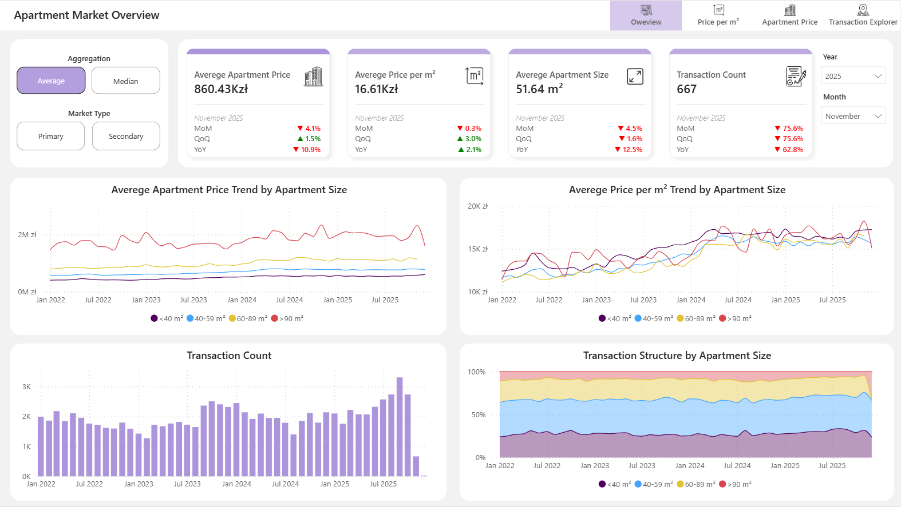
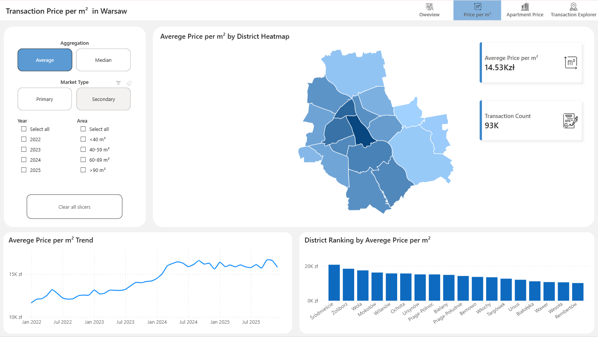
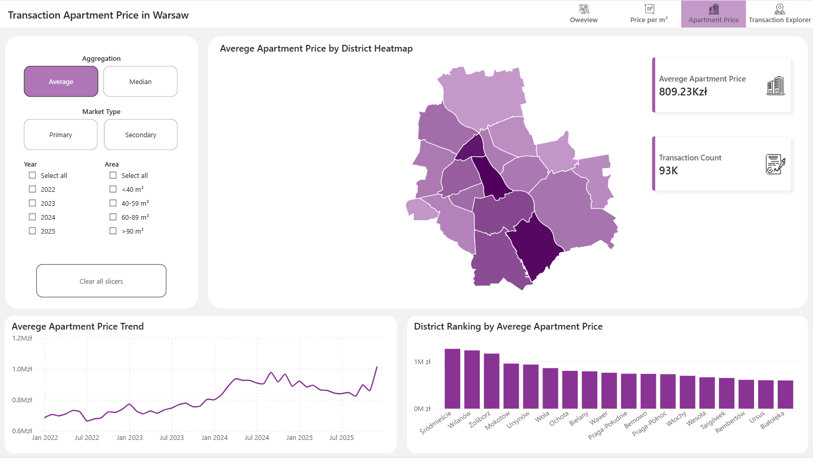
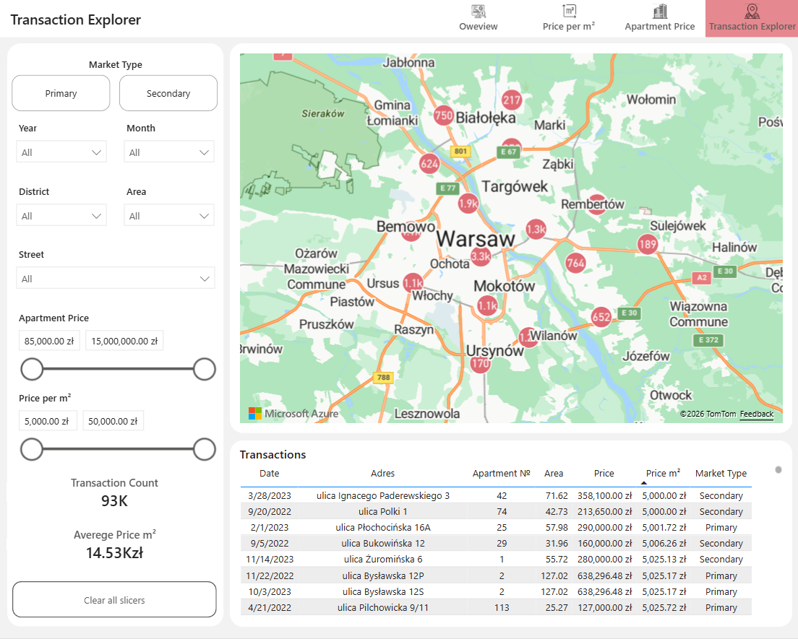

# 🏙️ Warsaw Real Estate Analysis

An end-to-end analytics project focused on the Warsaw residential real estate market using official transaction data from the Polish Real Estate Price Register (RCN).

The project combines geospatial data processing, PostgreSQL, and Power BI to create an interactive BI solution for exploring apartment prices, price per square meter, market trends, and transaction distribution across Warsaw districts.

<br>

## 🎯 Business Goal

The residential property market generates a large volume of transaction data, making it difficult to identify pricing trends and compare locations.

The goal of this project is to build a decision-support tool that helps:

- Compare apartment prices across Warsaw districts
- Analyze price per m² trends over time
- Explore differences between primary and secondary markets
- Identify high-value and premium locations
- Investigate individual transactions using an interactive map

The dashboard is designed for potential home buyers, investors, real estate analysts, and market researchers.

<br>

## 📊 Dashboard

### Apartment Market Overview

Provides a high-level view of the Warsaw apartment market, including:

- Average apartment price
- Average price per m²
- Average apartment size
- Transaction volume
- Market dynamics by apartment size segment



<br>

### Price per m² Analysis

Analyze the spatial distribution of apartment prices across Warsaw districts.

Features:

- District heatmap
- District ranking
- Historical price trends
- Market and apartment size filtering



<br>

### Apartment Price Analysis

Explore the distribution of total apartment prices across the city.

Features:

- District heatmap
- District ranking
- Historical price evolution
- Market comparison



<br>

### Transaction Explorer

Interactive transaction-level exploration tool.

Features:

- Transaction map
- District and street filtering
- Price and area filtering
- Detailed transaction table



<br>

## 🚀 Live Dashboard

**Power BI Service:**

[🔗 Open Dashboard](https://app.powerbi.com/view?r=eyJrIjoiNzEwMmExNDYtMGZiNS00NjU5LTk4NjQtNWY5NGZmYjNlYTI1IiwidCI6IjY2ZmViZjA0LTBjNWMtNGYwMi1hMzA2LTM3OTFlYjIyNWNhNSJ9)

<br>

## 🗺️ Data Sources

### Administrative Boundaries (JPT)

Administrative boundary polygons were used to identify Warsaw districts.

The dataset was cleaned and filtered to keep only Warsaw district geometries before being loaded into PostgreSQL.

### Real Estate Transactions (RCN)

Transaction data was obtained from the Polish Real Estate Price Register (RCN).

The analysis includes only:

- Residential apartments
- Warsaw transactions
- Primary and secondary markets
- Transactions involving private and legal entities
- Transactions with 100% ownership share

This filtering ensures that only complete apartment sales are included in the analysis.

<br>

## ⚙️ Data Processing Pipeline

### District Preparation

Notebook:

```text
01_district_boundaries_etl.ipynb
```

Main steps:

- Load administrative boundary data
- Filter Warsaw districts
- Clean and standardize geometry
- Load data into PostgreSQL

### Transaction Preparation

Notebook:

```text
02_apartment_transactions_etl.ipynb
```

Main steps:

- Load RCN transaction data
- Filter apartment transactions
- Calculate price per m²
- Perform spatial join with district polygons
- Load data into PostgreSQL

<br>

## 🛠️ Tech Stack

### Data Processing

- Python
- Pandas
- GeoPandas
- SQLAlchemy
- PostgreSQL

### GIS

- Spatial Joins
- Polygon Geometry Processing

### Visualization

- Power BI
- DAX

<br>

## 📂 Repository Structure

```text
📦 warsaw-real-estate-analysis
│
├── 📁 Notebooks
│   ├── 01_district_boundaries_etl.ipynb
│   └── 02_apartment_transactions_etl.ipynb
│
├── 📁 PowerBi
│   └── Warsaw_Real_Estate.pbix
│
├── 📁 Images
│   ├── page_1_apartment_market_overview.png
│   ├── page_2_transaction_price_per_m2.png
│   ├── page_3_transaction_apartment_price.png
│   └── page_4_transaction_explorer.png
│
├── 📄 requirements.txt
├── 📄 .env.example
├── 📄 .gitignore
└── 📄 README.md
```

<br>

## 💡 Project Outcome

This project transforms raw government transaction data into an interactive BI solution that enables users to explore the Warsaw residential property market at both district and individual transaction levels.

The solution combines geospatial analytics, data engineering, and business intelligence to support data-driven real estate decisions.

## 👤 Author

**Vitali Kandrashou**
